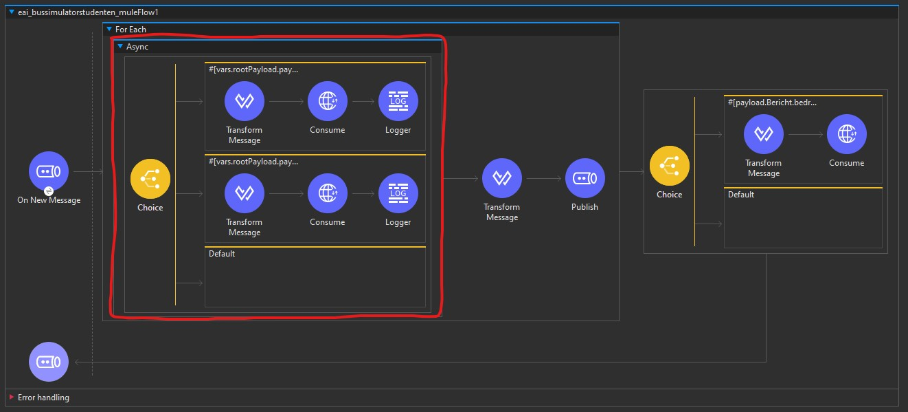

# Opdrachten week 2

# Opdracht 1

> In Leertaak 3 hebben we de halte-berichten doorgestuurd naar de QBUZZ-webserver. Zorg er voor dat de andere twee services van de QBUZZ SOAP-server ook op de juiste manier worden aangeroepen vanuit de AnyPoint flow.

Zie onze code en Anypoint view.

# Opdracht 2

> Geef van de verschillende componenten die je in de flow gebruikt hebt aan of ze synchroon of asynchroon zijn. Bij leertaak 3 is de choice naar een asynchroon blok gehaald. Waarom is dit een goede keuze?

De reden dat wij het choice blok asynchroon hebben gemaakt is omdat de flow moet wachten op een response. Zou hij niet asynchroon zijn dan moeten de volgende berichten serieel wachten op het resultaat van de vorige berichten. Als er geen gebruik wordt gemaakt van async verlaagt de throughput van het systeem significant **(impedance mismatch)**.

# Opdracht 3

> a. Als je een webservice beschikbaar maakt is het van belang dat op de één of andere manier bekend wordt hoe service benaderd kan worden en waar de service beschikbaar is. We hebben bij leertaak 2 gezien dat bij een SOAP service een contract gepubliceerd wordt in de vorm van een WSDL. Bij Rest API's kan gebruik gemaakt worden van bijvoorbeeld RAML of Swagger (Open API). Maak een vergelijking tussen SOAP en RAML, beschrijf hierin de overeenkomsten en verschillen met betrekking tot de architectuur, gebruikte technieken, noodzakelijke onderdelen van de implementatie, etc.

-   SOAP is een manier van communiceren, RAML is een beschrijving van een (vaak RESTful) API.
-   RAML/REST is losjes gebaseerd op het HTTP protocol (GET, PUT, POST, DELETE, etc.) en is een architectural stijl, terwijl SOAP zelf een protocol is. Dit betekent dat het implementeren van REST verschillend kan zijn per use-case/project terwijl SOAP een gestandaardizeerd protocol is.
-   RAML wordt gepresenteerd in een YAML format terwijl SOAP gebruik maakt van XML.
-   Zowel SOAP als RAML/REST zijn communicatiemethoden tussen diverse entiteiten/services.

> b. Wat betekent de term contract-first met betrekking tot webservices? In de aangeleverde code genereert de Enpoint.publish het contract, welke tool kun je gebruiken om contract-first in Java te gebruiken bij SOAP servers?

Een contract-first webservice is een soort ontwikkelstijl waarbij de ontwikkeling van de webservice start met het WSDL contract wat gevolgt wordt door de Java code. Dit verschilt vergeleken met een contract-first approach waarbij de WSDL wordt gegenereerd op basis van de Java code.

Contract-first is populairder omdat het genereren van de WSDL op basis van de Java code een aantal problemen heeft. Zo kunnen XML element die gegenereerd worden op basis van Java objecten bepaalde properties verliezen die in Java belangrijk zijn, komen de types soms niet overeen en kan er een cyclische afhankelijkheid ontstaan. Daarnaast krijg je te maken met het probleem dat het WSDL contract constant aanpassingen zal krijgen naarmate te code verder ontwikkeld wordt, zo zal je de andere services die praten met de web service ook aan moeten passen.

Een tool die veel gebruikt wordt bij het ontwikkelen van SOAP servers in Java is Spring Web Services. Spring Web Services ondersteund alleen de contract-first development stijl.
